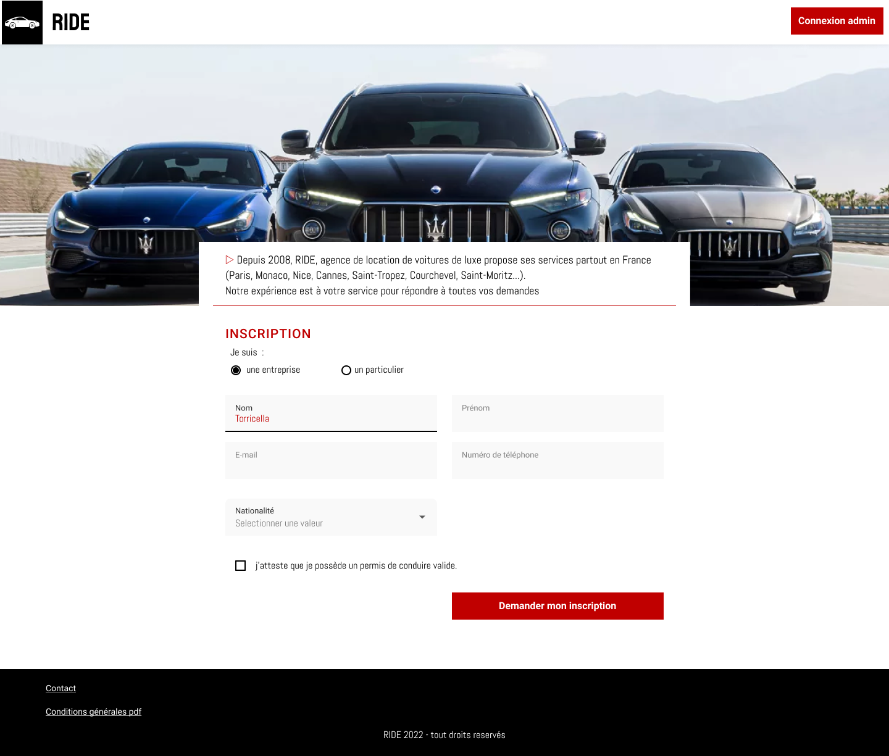

# Ride Desktop
_____


> FullStack Course - YNOV M1 INFO


## Installing / Getting started
_____
### Front: 
```bash
cd vitrine
npm install
npm run dev
```
Now you can access the front on http://localhost:3000

### Storybook
```bash
cd design-system
npm install
npm run storybook
```
Now you can access the storybook on http://localhost:6006


## Design 
_____
This project use [Figma](https://www.figma.com) to design the interface.<br>
Find the design [here](https://www.figma.com/file/g8RWbQyy4lqxbeOQBeYsV7/Gamos-2022---JoAzCo?node-id=13%3A1509&t=Lzh4GlVoPbnHqsnO-1)




